# Module 7 - Profiling

## Performance Testing Results

### JMeter Results - Before vs After Optimization

### /all-student
**Before:**
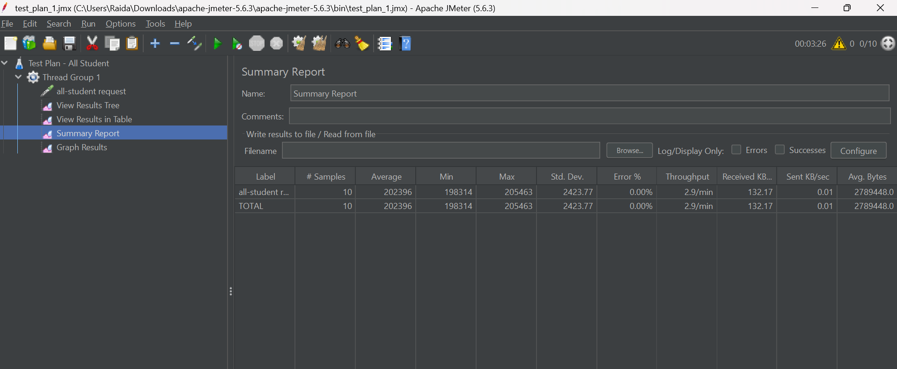
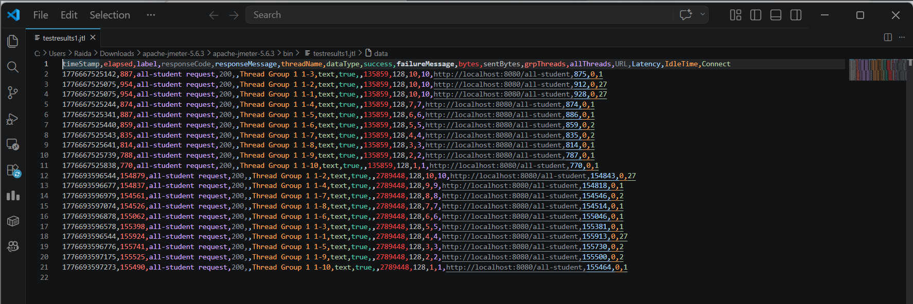

**After:**
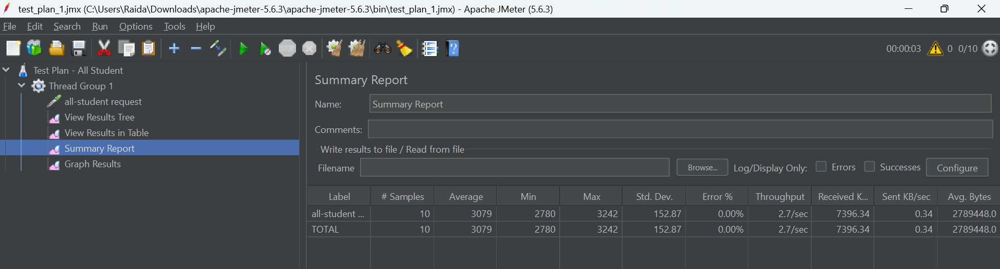
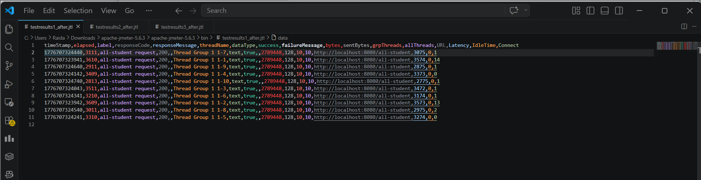

**Optimization Applied:**
- Menghilangkan **N+1 Query Problem** dimana sebelumnya terjadi
  20.000+ query ke database untuk setiap mahasiswa
- Menggunakan **JOIN FETCH** pada JPQL query untuk mengambil data StudentCourse beserta Student dan Course dalam 1 query
- Jumlah query ke database berkurang drastis 
---

### /all-student-name
**Before:**
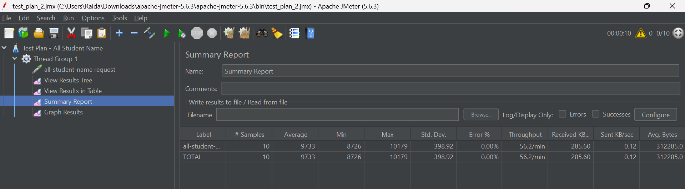
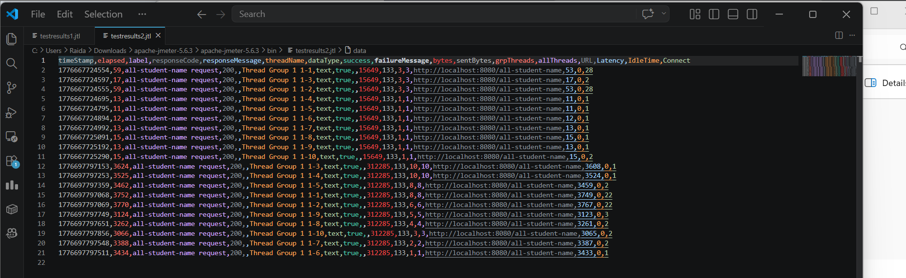

**After:**
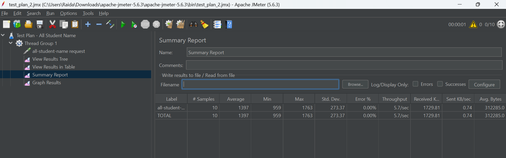
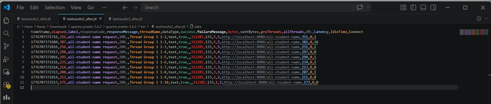

**Optimization Applied:**
- Mengganti String concatenation manual (`result += name + ", "`)
  yang membuat objek String baru di setiap iterasi
- Menggunakan `Stream` dan `Collectors.joining()` yang jauh
  lebih efisien dalam penggunaan memori
- Mengurangi overhead garbage collector akibat pembuatan
  objek String yang berulang-ulang
---

### /highest-gpa
**Before:**
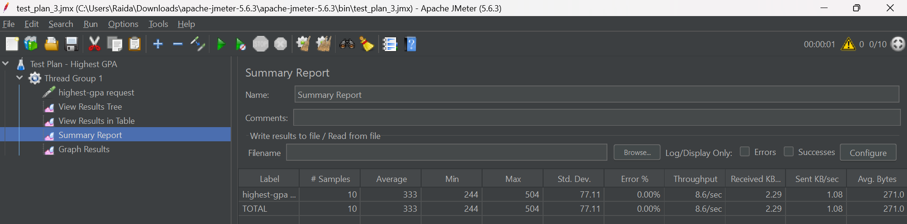
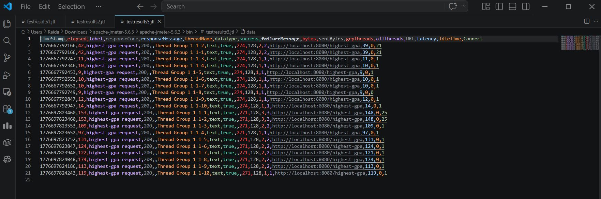

**After:**
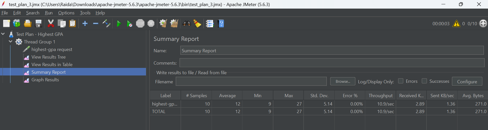
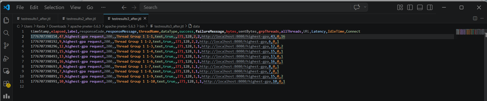
**Optimization Applied:**
- Menghilangkan loop manual yang mengiterasi seluruh data mahasiswa
  hanya untuk mencari nilai GPA tertinggi
- Menggunakan `findTopByOrderByGpaDesc()` sehingga pencarian
  dilakukan langsung di level database
- Database hanya mengembalikan 1 record teratas, bukan
  seluruh data mahasiswa

## COMPARISON
| Endpoint | Average Before (ms) | Average After (ms) | Improvement |
|---|---|---|---|
| /all-student | 202,396 | 3,079 | 98.5% ✅ |
| /all-student-name | 9,733 | 1,397 | 85.6% ✅ |
| /highest-gpa | 333 | 12 | 96.4% ✅ |

## Profiling Results - Before vs After Optimization

### IntelliJ Profiler Results (CPU Time)

### /all-student
**Before:**
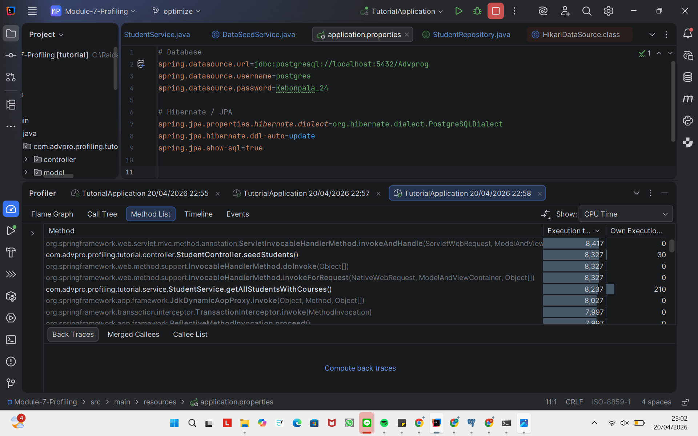

**After:**
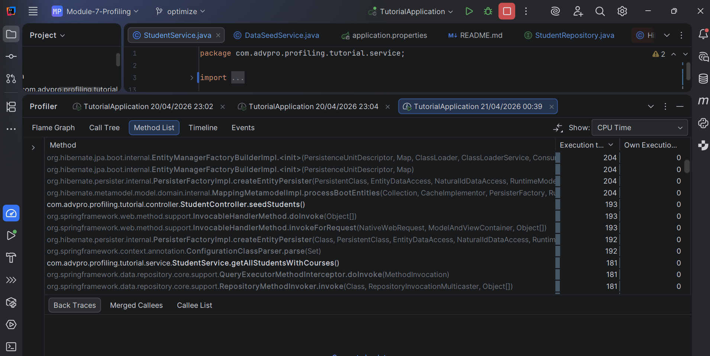

---

### /all-student-name
**Before:**
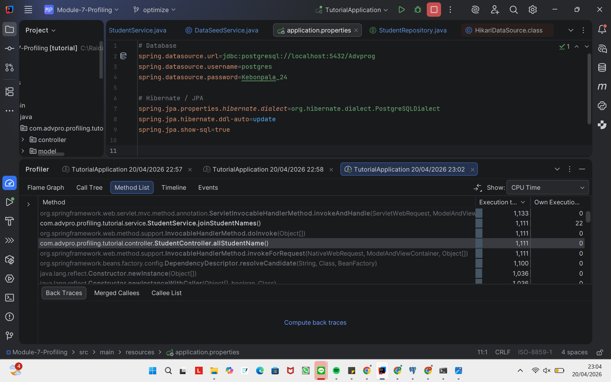

**After:**
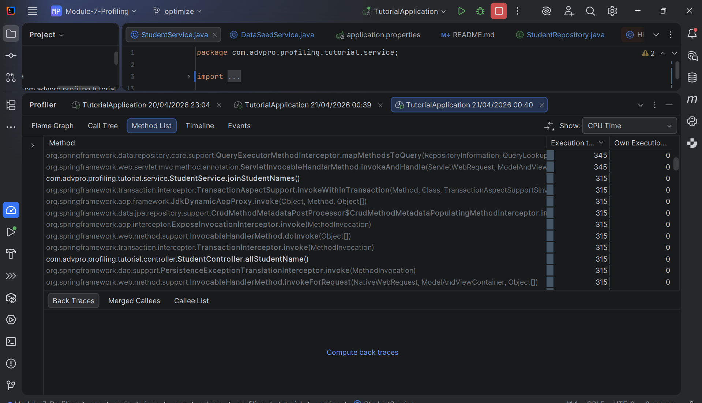

---

### /highest-gpa
**Before:**
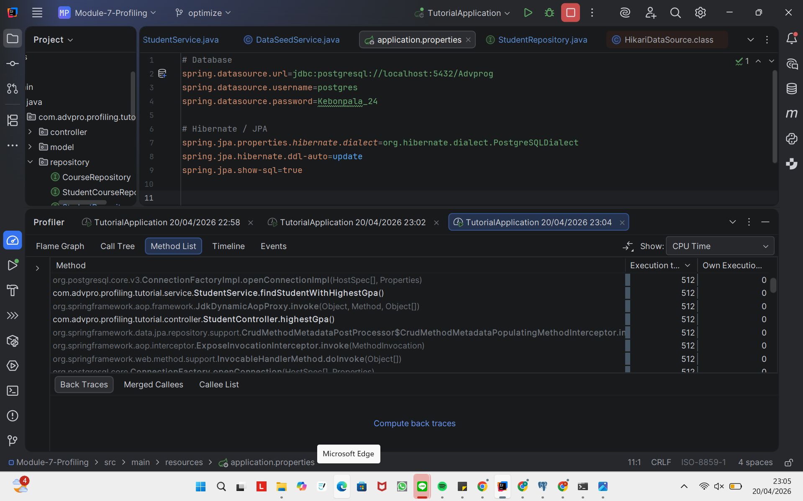

**After:**
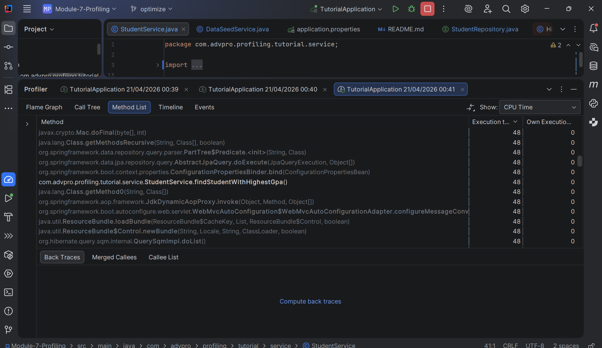

---
## COMPARISON
| Endpoint | Method | CPU Time Before (ms) | CPU Time After (ms) | Improvement |
|---|---|---|---|---|
| /all-student | getAllStudentsWithCourses() | 8,237 | 181 | 97.8% ✅ |
| /all-student-name | joinStudentNames() | 1,111 | 315 | 71.6% ✅ |
| /highest-gpa | findStudentWithHighestGpa() | 512 | 48 | 90.6% ✅ |

All three endpoints exceeded the required 20% improvement threshold by a significant margin.
---

## Summary of Performance Gains

| Endpoint | JMeter Improvement | Profiler Improvement |
|---|---|---|
| **/all-student** | **98.5% faster** | **97.8% faster** |
| **/all-student-name** | **85.6% faster** | **71.6% faster** |
| **/highest-gpa** | **96.4% faster** | **90.6% faster** |

**All endpoints achieved more than the required 20% improvement!**
